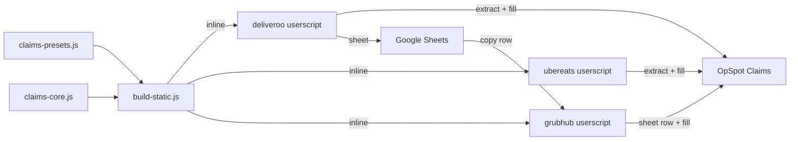

# Claims Auto-Fill Scripts

Tampermonkey userscripts that read order/refund data from **Deliveroo**, **Uber Eats**, or a **Grubhub Google Sheet**, then fill the **OpSpot Claims** (Workhorse) form. You always click **Save** yourself — the scripts never submit the form.

Each `.user.js` file is **self-contained** (presets + core inlined). Edit shared logic in `claims-presets.js` / `claims-core.js`, then run `node build-static.js` and re-paste the userscripts.

---

## Files

| File | Role |
|------|------|
| [`claims-presets.js`](claims-presets.js) | **Edit here** — Workhorse labels/fill order + platform presets |
| [`claims-core.js`](claims-core.js) | Shared OpSpot fill engine, rules, transfer, UI, sheet helpers |
| [`build-static.js`](build-static.js) | Inlines presets + core into `.user.js` files |
| [`deliveroo-claims-autofill.user.js`](deliveroo-claims-autofill.user.js) | Deliveroo userscript |
| [`ubereats-claims-autofill.user.js`](ubereats-claims-autofill.user.js) | Uber Eats userscript |
| [`grubhub-claims-autofill.user.js`](grubhub-claims-autofill.user.js) | Grubhub Google Sheet → OpSpot |



---

## Setup (one-time)

1. Install **[Tampermonkey](https://www.tampermonkey.net/)** in Chrome (or Edge/Firefox).
2. In Chrome → `chrome://extensions` → Tampermonkey → enable **Allow User Scripts**.
3. Paste / import the full userscript (no external `@require`):
   - [`deliveroo-claims-autofill.user.js`](https://github.com/nachtalia/automation/blob/main/deliveroo-claims-autofill.user.js)
   - [`ubereats-claims-autofill.user.js`](https://github.com/nachtalia/automation/blob/main/ubereats-claims-autofill.user.js) (if you use Uber)
   - [`grubhub-claims-autofill.user.js`](https://github.com/nachtalia/automation/blob/main/grubhub-claims-autofill.user.js) (Grubhub sheet)
4. Enable the scripts, then refresh the matching tabs.

### OpSpot Platform dropdown

Confirm **Platform** includes **Deliveroo**, **Uber Eats**, and **Grubhub** (exact spelling).

### Share with a teammate

Send them this repo: **https://github.com/nachtalia/automation**  
They install Tampermonkey, paste the `.user.js` file(s) from `main`, and refresh.

### OpSpot page

`https://opspot.workhorselive.com/sysTable.php?sys_module_id=10000&sys_data_entity_id=10000#`

---

## Editing presets (no extractor changes)

Open [`claims-presets.js`](claims-presets.js).

| What to change | Where |
|----------------|--------|
| OpSpot field labels | `workhorse.labels` |
| Fill order / which payload key → which OpSpot field | `workhorse.fills` |
| Default video / Not disputed threshold (£) | `workhorse.videoSubmitted`, `workhorse.disputeThresholdGbp` (Partner refund ≤ amount → Not disputed). Override in Deliveroo **Map & conditions → Conditions**. |
| Deliveroo reason → Workhorse Reason for Dispute | `platforms.deliveroo.reasonMap` (includes Incomplete → Missing Item) |
| Uber reason → Workhorse | `platforms.ubereats.reasonMap` |
| Canonicalize patterns | `platforms.*.canonicalizeRules` |
| Outcome / footage rules | `platforms.*.outcomeRules` / `footageRules` |
| Customer aliases (e.g. Popeyes France) | `platforms.*.customerAliases` |
| Google Sheet columns / brand tabs | `platforms.deliveroo.sheet` |
| Sheet wording for Refund Reason | `platforms.deliveroo.sheet.refundReasonOverrides` (follows Workhorse reason map, e.g. incomplete → Incorrect Item) |

After editing presets or core:

```bash
node build-static.js
```

Then re-paste the updated `.user.js` into Tampermonkey and refresh the tabs.

---

## Deliveroo workflow

1. Open the refund page on **Deliveroo Partner Hub**.
2. *(Optional)* Click **Map & conditions**:
   - **Field maps** — click page text for each Workhorse field  
   - **Conditions** — location/customer aliases (when Deliveroo names differ from Workhorse), reason overrides, and a list of built-in outcome rules  
3. Click **Auto-Fill & Dispute**.
4. Check the preview.
5. OpSpot Claims → **Add New** → **Fill from Deliveroo**.
6. Review, then **Save** (or **Save and Add New**).

### Copy to Google Sheet

Brand → tab (from presets): Shake Shack, Jollibee UK, Popeyes.

1. **Copy for Google Sheet** on the refund page.
2. Open the dispute log sheet → **Paste Deliveroo → Sheet Tab**.
3. Click the next empty row and paste (`Ctrl+V`).

| Sheet column | Value |
|--------------|--------|
| Date | `DD-MM-YYYY` (forced as text) |
| Restaurant | Brand / customer |
| Location | Branch only |
| # Order Number | Order number |
| Refund Reason | e.g. Missing Items / Incorrect Item / Prepared incorrectly |
| With Video? | (blank) |
| Footage Status | From footage rules |
| Work Type | Deliveroo |
| Comments | (blank) |

---

## Uber Eats workflow

1. Open the order on **Uber Eats Manager**.
2. Click **Extract Order → OpSpot**.
3. OpSpot → **Add New** → **Fill from Uber Eats**.
4. Review, then **Save**.

| OpSpot field | Source |
|--------------|--------|
| Order Number | Short order code |
| Customer / Location | Brand under date / address beside brand |
| Claim Date / Order Time | Order date / Order placed time |
| Order Value | Sales (incl. GST) |
| Dispute Amount | Chargeback Amount (absolute) |
| Platform | Uber Eats |

**Other reason** includes customer, location, and issue item names when configured in the Uber preset.

---

## Grubhub sheet workflow

Sheet: [Grubhub adjustments](https://docs.google.com/spreadsheets/d/1fLAWWmj_ZBIUQ-AJirNrY_yw6r03JwnsPvPb1Qcae1o/edit?gid=1584984751#gid=1584984751)

1. Open the sheet and click the **row number** (selects the whole row).
2. **Ctrl+C** to copy.
3. Click **Extract sheet row → OpSpot** (orange button).
4. *(Optional)* Click **Map & conditions** (draggable). Map sheet columns to Workhorse fields, or tweak aliases, reasons, and outcomes. Re-extract after a change.
5. OpSpot Claims → **Add New** → **Fill from Grubhub**.
6. Review, then **Save**.

| OpSpot field | Sheet column |
|--------------|----------------|
| Claim Date / Order Time | Date / Time |
| Customer / Location | Restaurant Name (`Brand - Location`) |
| Platform | Grubhub |
| Order Number | Order ID |
| Order Value | Subtotal (absolute) |
| Dispute Amount | Restaurant Total (absolute) |
| Reason for Dispute | Reason / Description (`MISSING_ITEM` → Missing Item, `INCORRECT_ITEM` → Incorrect Item) |
| Other reason | Reason text (+ restaurant) |

---

## Tips

- Extract on the platform/sheet tab first, then Fill on OpSpot.
- After **Save and Add New**, the script can refill if a new order was already extracted.
- Teal = Deliveroo (`dcf-`); green = Uber Eats (`ucf-`); orange = Grubhub (`gcf-`).
- If the console says presets/core are missing, re-run `node build-static.js` and re-paste the full `.user.js`.

---

## Troubleshooting

| Problem | What to try |
|---------|-------------|
| Button doesn’t appear | Script enabled? Refresh? URL match? Console error about ClaimsPresets? |
| “No stored order” on OpSpot | Extract on the platform tab first |
| Wrong / missing fields | Re-extract; check preview `NOT FOUND`; adjust `reasonMap` / `fills` in presets, then rebuild |
| Fill does nothing | Re-paste latest static `.user.js` (v2.2.4+); open Add New first |
| Platform dropdown wrong | OpSpot options must be exactly **Deliveroo** / **Uber Eats** / **Grubhub** |
| Grubhub extract fails | Click the **row number** (not one cell), Ctrl+C, then Extract; allow clipboard if prompted |

---

## Notes

- Scripts never auto-click **Save**.
- Agent / Won Revenue / Lost Revenue are left alone on purpose.
- Shared payload shape: `orderNumber`, `customer`, `location`, `orderValue`, `disputeAmount`, `reasonForDispute`, `otherReason`, etc. — platform extractors write it; core fills OpSpot from `workhorse.fills`.
