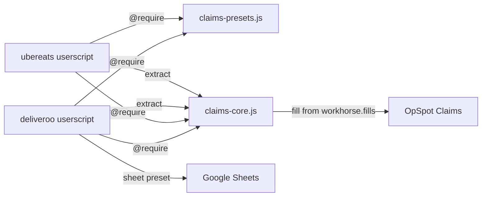

# Claims Auto-Fill Scripts

Tampermonkey userscripts that read order/refund data from **Deliveroo** or **Uber Eats**, then fill the **OpSpot Claims** (Workhorse) form. You always click **Save** yourself — the scripts never submit the form.

Field mappings, reason maps, outcome rules, and OpSpot fill order live in a **shared presets file** used by both platforms.

---

## Files

| File | Role |
|------|------|
| [`claims-presets.js`](claims-presets.js) | **Edit here** — Workhorse labels/fill order + Deliveroo & Uber Eats presets (reason maps, outcome/footage rules, sheet tabs) |
| [`claims-core.js`](claims-core.js) | Shared OpSpot fill engine, rules, transfer, UI, sheet helpers |
| [`deliveroo-claims-autofill.user.js`](deliveroo-claims-autofill.user.js) | Deliveroo page extractors + buttons (v2.0.0) |
| [`ubereats-claims-autofill.user.js`](ubereats-claims-autofill.user.js) | Uber Eats page extractors + buttons (v2.0.0) |



---

## Setup (one-time)

1. Install **[Tampermonkey](https://www.tampermonkey.net/)** in Chrome (or Edge/Firefox).
2. In Chrome → `chrome://extensions` → Tampermonkey → enable **Allow User Scripts**.
3. Install the userscripts from this repo (paste or import):
   - [`deliveroo-claims-autofill.user.js`](https://github.com/nachtalia/automation/blob/main/deliveroo-claims-autofill.user.js)
   - [`ubereats-claims-autofill.user.js`](https://github.com/nachtalia/automation/blob/main/ubereats-claims-autofill.user.js) (if you use Uber)
4. Each script `@require`s shared files from GitHub automatically:
   ```
   // @require https://raw.githubusercontent.com/nachtalia/automation/main/claims-presets.js
   // @require https://raw.githubusercontent.com/nachtalia/automation/main/claims-core.js
   ```
   You do **not** need a local copy of presets/core for day-to-day use.
5. Enable the scripts, then refresh Deliveroo / Uber / OpSpot tabs.

### Share with a teammate

Send them this repo: **https://github.com/nachtalia/automation**  
They install Tampermonkey, paste the two `.user.js` files from `main`, and refresh. No folder path setup.

If the repo is **private**, add them as a GitHub collaborator (raw `@require` needs access to the files). For private repos, a simpler option is: they clone the repo and temporarily switch `@require` to their local `file:///` paths.

### OpSpot page

`https://opspot.workhorselive.com/sysTable.php?sys_module_id=10000&sys_data_entity_id=10000#`

Confirm the **Platform** dropdown includes **Deliveroo** and **Uber Eats**.

---

## Editing presets (no extractor changes)

Open [`claims-presets.js`](claims-presets.js).

| What to change | Where |
|----------------|--------|
| OpSpot field labels | `workhorse.labels` |
| Fill order / which payload key → which OpSpot field | `workhorse.fills` |
| Default video / £2 threshold | `workhorse.videoSubmitted`, `workhorse.disputeThresholdGbp` |
| Deliveroo reason → Workhorse Reason for Dispute | `platforms.deliveroo.reasonMap` (includes Incomplete → Missing Item) |
| Uber reason → Workhorse | `platforms.ubereats.reasonMap` |
| Canonicalize patterns | `platforms.*.canonicalizeRules` |
| Outcome / footage rules | `platforms.*.outcomeRules` / `footageRules` |
| Customer aliases (e.g. Popeyes France) | `platforms.*.customerAliases` |
| Google Sheet columns / brand tabs | `platforms.deliveroo.sheet` |
| Sheet wording “Missing Items” | `platforms.deliveroo.sheet.refundReasonOverrides` |

After editing presets or core **and pushing to `main`**, refresh the platform/OpSpot tabs so Tampermonkey reloads `@require` from GitHub.

---

## Deliveroo workflow

1. Open the refund page on **Deliveroo Partner Hub**.
2. *(Optional)* Click **Map & conditions**:
   - **Field maps** — click page text for each Workhorse field  
   - **Conditions** — location/customer aliases (when Deliveroo names differ from Workhorse), reason overrides, and a list of built-in outcome rules  
3. Click **Auto-Fill & Dispute**.
4. Check the preview.
5. OpSpot Claims → **Add New** → **Fill from Deliveroo**.
6. Review, then **Save** (or **Save and Add New**).

### Copy to Google Sheet

Brand → tab (from presets): Shake Shack, Jollibee UK, Popeyes.

1. **Copy for Google Sheet** on the refund page.
2. Open the dispute log sheet → **Paste Deliveroo → Sheet Tab**.
3. Click the next empty row and paste (`Ctrl+V`).

| Sheet column | Value |
|--------------|--------|
| Date | `DD-MM-YYYY` (forced as text) |
| Location | Branch only |
| # Order Number | Order number |
| Refund Reason | e.g. Missing Items / Incorrect Item / Prepared incorrectly |
| With Video? | No |
| Footage Status | From footage rules |
| Comments | (blank) |

---

## Uber Eats workflow

1. Open the order on **Uber Eats Manager**.
2. Click **Extract Order → OpSpot**.
3. OpSpot → **Add New** → **Fill from Uber Eats**.
4. Review, then **Save**.

| OpSpot field | Source |
|--------------|--------|
| Order Number | Short order code |
| Customer / Location | Brand under date / address beside brand |
| Claim Date / Order Time | Order date / Order placed time |
| Order Value | Sales (incl. GST) |
| Dispute Amount | Chargeback Amount (absolute) |
| Platform | Uber Eats |

**Other reason** includes customer, location, and issue item names when configured in the Uber preset.

---

## Tips

- Extract on the platform tab first, then Fill on OpSpot.
- After **Save and Add New**, the script can refill if a new order was already extracted.
- Teal buttons = Deliveroo (`dcf-`); green = Uber Eats (`ucf-`).
- If the console says presets/core are missing, check network access to `raw.githubusercontent.com` and that the files exist on `main`.

---

## Troubleshooting

| Problem | What to try |
|---------|-------------|
| Button doesn’t appear | Script enabled? Refresh? URL match? Console error about ClaimsPresets? |
| “No stored order” on OpSpot | Extract on the platform tab first |
| Wrong / missing fields | Re-extract; check preview `NOT FOUND`; adjust `reasonMap` / `fills` in presets |
| `@require` fails | Open the raw GitHub URLs in a browser; confirm files are on `main`; check Tampermonkey can fetch external scripts |
| Platform dropdown wrong | OpSpot options must be exactly **Deliveroo** / **Uber Eats** |

---

## Notes

- Scripts never auto-click **Save**.
- Agent / Won Revenue / Lost Revenue are left alone on purpose.
- Shared payload shape: `orderNumber`, `customer`, `location`, `orderValue`, `disputeAmount`, `reasonForDispute`, `otherReason`, etc. — platform extractors write it; core fills OpSpot from `workhorse.fills`.
